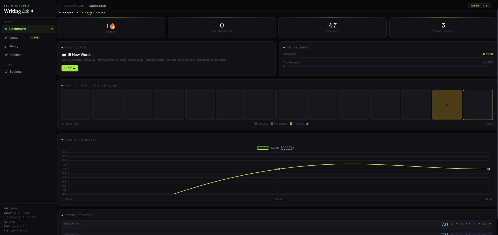
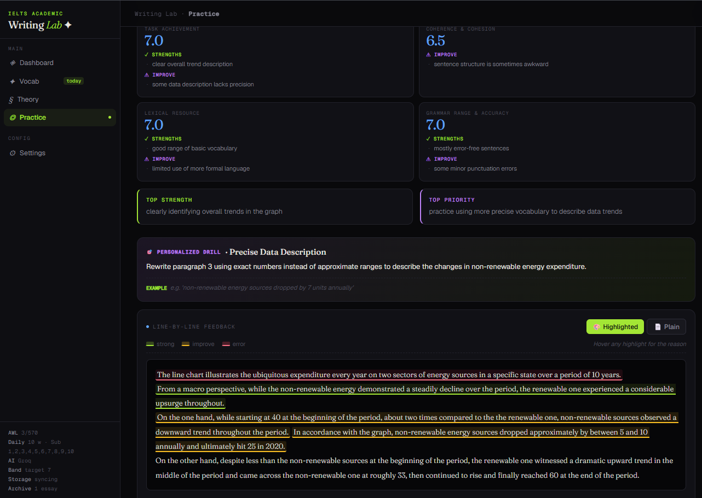
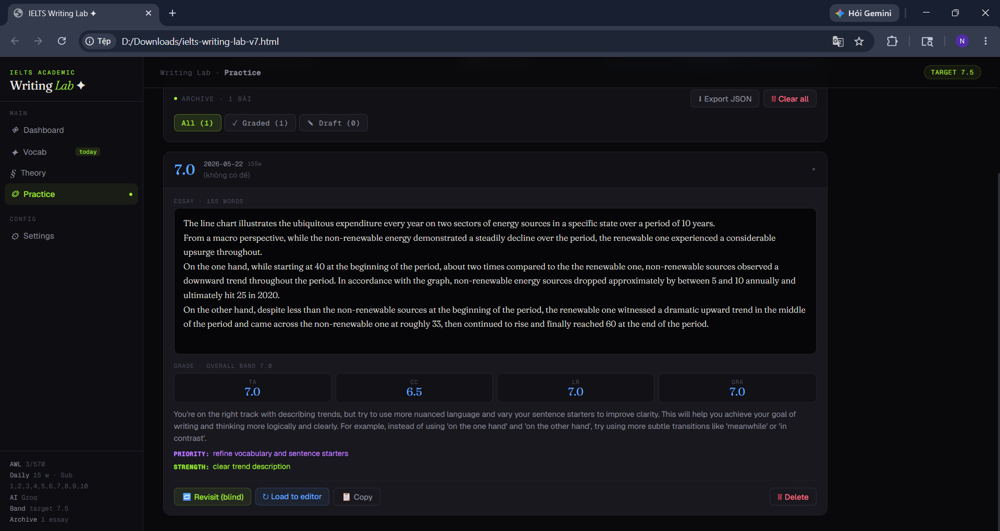

# IELTS Writing Lab

> A privacy-first, browser-based IELTS Academic study tool — Writing, Reading, and Vocabulary in one place, powered by your own AI provider key.

No server. No database. No analytics. All progress lives in your browser's `localStorage`. Bring your own AI key (Gemini, Groq, DeepSeek, Zhipu, Claude…) and the app handles generation, grading, scheduling, and tracking.



---

## Why this exists

Most IELTS prep options have at least one of these problems:

- **Cambridge books and paid platforms** are expensive and the content is finite. Once you've done all 18 books, you've done them.
- **Free online practice sites** mostly recycle leaked exam content (copyright-grey) and gate the good stuff behind paywalls.
- **Generic AI chatbots** produce essays and reading passages that don't pass as Cambridge — too verbose, full of *"in conclusion"*, *"delve into"*, and *"plays a crucial role in the tapestry of…"*.
- **Vocabulary apps** treat words in isolation, with no connection to the IELTS contexts where you actually need them.
- **Tracking progress** across writing, reading, and vocab usually means juggling spreadsheets and praying nothing breaks.

This project addresses all of these in one tool, keeps your data 100% local, and gives you direct control over the AI backend so you can pick the provider that fits your region and budget.

---

## Features

### ✍️ Writing
- **Task 1 & Task 2 practice** — AI generates fresh prompts every time, never recycled
- **AI grading** across all four IELTS criteria (TA / CC / LR / GRA) with paragraph-level feedback
- **Full Writing test simulator** — 60-min timer, two-task weighted scoring
- **Error bank** — every correction is logged so you can review recurring patterns
- **Rewrite trainer** — iterate on the same paragraph until it lands
- **Band score predictor** with rolling history chart



### 📖 Reading Lab — multi-step authentic generation
Unlike single-shot AI prompts, the Reading module runs a **5-step pipeline** that mirrors how Cambridge item-writers actually work:

1. **(Optional) Wikipedia grounding** — type any subject, the app fetches the matching article so the passage is built on real facts (names, dates, statistics) instead of hallucinated ones
2. **Passage generation** with detailed Cambridge style spec (register, structure, contested claims, contrasted viewpoints, vocabulary density)
3. **AI-tell filter** — regex-scans the draft for phrases that never appear in real IELTS (*"in conclusion"*, *"delve into"*, *"tapestry of"*, overused *"moreover"*) and retries once with a corrective instruction
4. **Per-type question generation** — each question type gets its own specialist prompt (T/F/NG, MCQ, matching headings, summary/sentence completion, short answer) with anti-pattern rules
5. **Auto-save to dataset** — every generation becomes a future few-shot reference (see Dataset below)

**Three practice modes:**
| Mode | Length | Questions | Duration | API calls |
|---|---|---|---|---|
| Mini drill | 1 passage | 6–12 | 15 min | ~3 |
| Single section | 1 passage | 13 | 20 min | ~4 |
| Full test | 3 passages | 40 | 60 min | ~12 |

**16 question types** supported including T/F/NG, Y/N/NG, MCQ, matching headings, matching information, summary completion, sentence completion, short answer, and more.

**Cambridge-style practice UI** with strict answer checking, word-limit enforcement, highlighting, notes, flagging, dark mode, and per-section review analytics.



### 🗂️ Reading Dataset — few-shot that grows with use
Every passage you generate or import is automatically saved. The AI uses these as **style anchors for future generations** — first generation is generic, by the tenth your output matches your established house style.

- **Gold seed passages** — paste real Cambridge passages once; every future generation references them. The underlying tool's docs call this the single biggest quality lever.
- **Import** JSON from the companion [IELTS Reading Tool](https://github.com/) Python pipeline (Wikipedia → extract facts → rewrite → LLM-as-judge)
- **Toggle per entry** which dataset items the AI may use as references
- **Export the whole dataset** as a JSON backup or to share between machines
- **Filter** by source: generated / imported / seed / few-shot-active

### 📚 Vocabulary
- **Academic Word List (AWL)** flashcards — 570 words, 10 sublists, hand-curated metadata
- **Spaced repetition** with per-word mastery tracking
- **Word debt** — words you've skipped on busy days accumulate for review
- **Custom vocab** auto-added from words you misused in your essays
- **Quiz mode** with multiple question formats
- **Boost sessions** for extra practice past your daily quota

 

### 📊 Dashboard
- **Learning heatmap** of daily activity (streaks visible at a glance)
- **Per-day telemetry** — target vs actual words studied, real progress not just "done" booleans
- **Band progress chart** from saved Writing and Reading tests
- **Weakness analytics** — which question types and skills you miss most


---

## Quick Start

### Option 1 — just open the file (no install)

1. Clone or download this repo
2. Double-click `index.html`
3. Settings → add an AI provider key (Gemini's free tier is the easiest start)
4. Start practicing

Data lives in your browser's `localStorage`. Back up regularly via **Settings → Data Management → Export**.

### Option 2 — run with the local dev server (recommended)

Adds automatic JSON file backup of your state to `data/app-state.json`:

```powershell
# After editing src/*.jsx files:
node scripts/build.mjs

# Start the local server:
node scripts/serve.mjs

# Open in browser:
# http://localhost:5173
```

**No `npm install` needed** — React, Babel, and Chart.js load from CDN.

---

## AI Providers

The app supports 16+ providers. Pick based on your region and budget:

### ✅ Confirmed working from anywhere (email signup only)
| Provider | Tier | Notes |
|---|---|---|
| **Gemini 2.0 Flash** | Free | 15 rpm · 1500/day · 1M TPM — recommended default |
| **Gemini 2.5 Pro** | Free | Smarter, 5 rpm |
| **Groq** | Free | Very fast, 30 rpm · 6k TPM limit |
| **OpenRouter** | Free `:free` models | 50/day free tier |
| **Zhipu GLM-4-Flash** | Free | Chinese provider, accepts international |

### 💳 Paid but easy global signup
| Provider | Notes |
|---|---|
| **DeepSeek** | ~$0.14/M tokens — cheapest reliable option |
| **Anthropic Claude** | Best structured-JSON output, ~$0.50/full reading test |
| **OpenAI**, **xAI Grok**, **Kimi**, **Mistral** | Various |

### ⚠ Often blocked outside US (require US phone verification)
Cerebras, SambaNova, Together AI, NVIDIA NIM, Hyperbolic — labeled honestly in the Settings dropdown.

**API keys live in `localStorage` and are sent directly browser → provider. No proxy server.**

---

## Privacy & data

**Everything stays on your machine.** Three storage locations:

| Where | What |
|---|---|
| Browser `localStorage` key `ielts_writing_lab_v1` | All progress, essays, reading tests, dataset, drafts |
| Browser `localStorage` key `ielts_lab_configs` | AI provider configs **including API keys** |
| `data/app-state.json` (only when serving with `scripts/serve.mjs`) | Mirror backup of state — excludes API keys |

No external server, no analytics, no telemetry. The only network calls the app makes are to the AI provider you configured (and optionally Wikipedia when you use the grounding feature).

⚠ **Keep your project folder private** — `data/app-state.json` contains your essays and progress. API keys live in `localStorage` as plain text.

---

## How it works under the hood

### Tech stack
- **React** (UMD build from CDN) + **in-browser Babel** transform — no bundler, no `node_modules`
- **Chart.js** for dashboard
- **`scripts/build.mjs`** concatenates `src/*.jsx` files into `dist/app.jsx`
- **`scripts/serve.mjs`** is a 100-line Node.js dev server that also exposes `/api/storage` for state file sync

### Source map
```
src/
├── 00-data.jsx              React hook aliases, AWL scheduling word list
├── 01-awl-card-data.jsx     Pre-baked AWL card data + lookup map
├── 02-api.jsx               AI provider presets, request wrapper, JSON repair
├── 03-vocab-utils.jsx       Word card generation, morphology, AWL extraction
├── 04-state.jsx             localStorage schema, migrations, scheduling
├── 05-common-components.jsx Shared UI (word card, quiz, band chart)
├── 06-dashboard.jsx         Dashboard + learning heatmap
├── 07-vocab.jsx             Vocabulary study, import, quiz, boost
├── 08-theory.jsx            Task 1 guide content
├── 09-practice-helpers.jsx  Chart/process/map renderers, vocab insights
├── 09-writing-examiner.jsx  IELTS examiner calibration, double-marking
├── 09-writing-suite.jsx     Score predictor, error bank, rewrite trainer
├── 10-practice.jsx          Writing hub, Task 1 generation
├── 11-full-test.jsx         Full Writing test simulator
├── 11-reading.jsx           Reading Lab (multi-step pipeline + dataset)
├── 11-settings.jsx          Goals, AI config, data management
├── 11-task2.jsx             Task 2 component
└── 12-app.jsx               Navigation + root render
```

### Editing workflow
```powershell
# Edit any src/*.jsx file, then:
node scripts/build.mjs       # rebuild dist/app.jsx
node scripts/serve.mjs       # serve at localhost:5173
```

---

## Limitations & honest caveats

1. **NOT a band-score predictor.** AI-graded bands track trends well but aren't exam-accurate. Use real Cambridge mocks for true band estimation.
2. **Generated content ≠ official Cambridge quality.** The multi-step pipeline + few-shot dataset + AI-tell filter + Wikipedia grounding push quality much higher than naive single-shot generation, but expect ~70–85% of T/F/NG and ~80–90% of MCQs to match exam standard. Hand-typed gold seeds raise this further.
3. **API costs scale with use.** Free Gemini handles most needs; a full Reading test on paid Claude costs ~$0.50.
4. **Desktop-first.** The UI works on mobile but isn't optimized for it.
5. **Single-user.** No accounts, no sync between devices — back up your JSON regularly.

---

## Roadmap / open ideas

- LLM-as-judge auto-retry for low-quality questions
- Speaking module with audio I/O
- Listening module
- Multi-device sync via opt-in cloud backend
- Spaced-repetition for reading question types you miss

PRs and issue reports welcome.

---

## License

MIT — see [LICENSE](LICENSE). Code is yours to modify and redistribute.

**Caveat on content:** generated passages use synthetic text from the AI provider. If you paste real Cambridge passages as gold seeds, your local dataset will contain copyrighted material — do not redistribute that dataset publicly.
